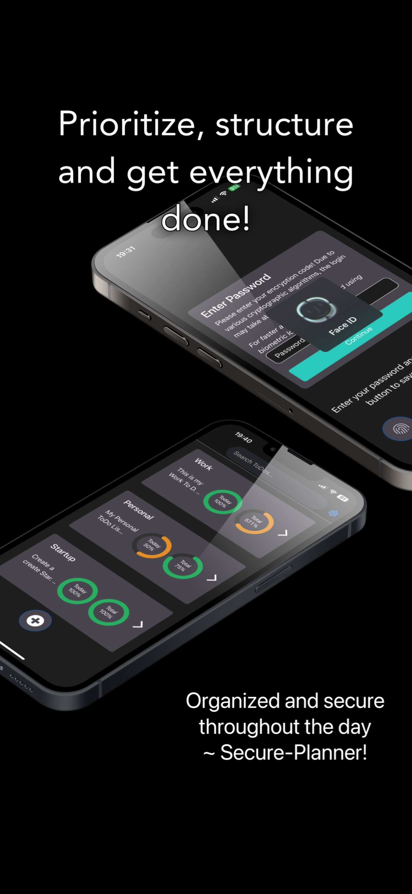
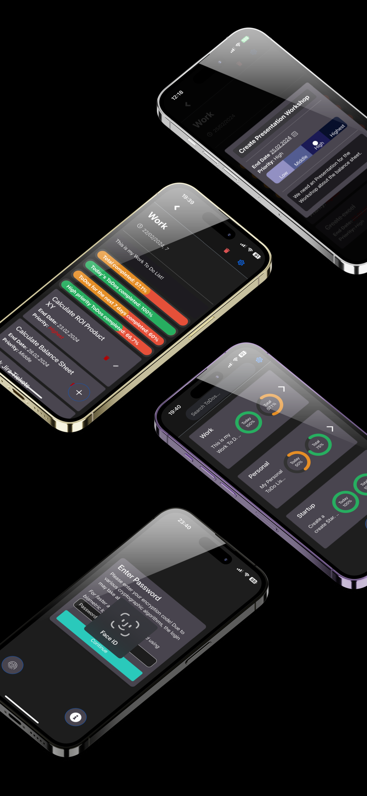
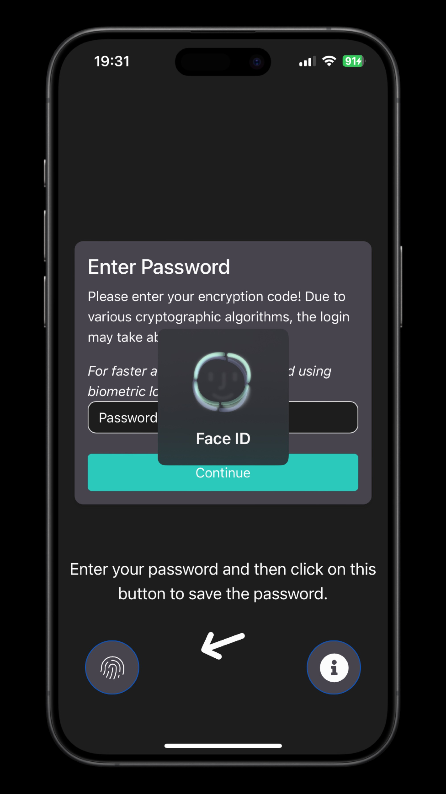
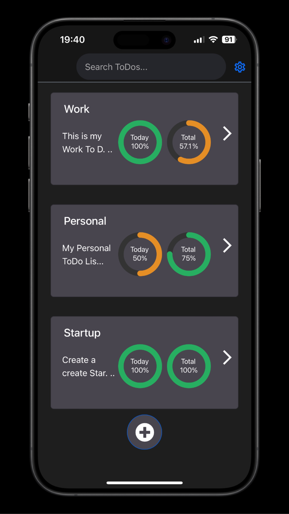
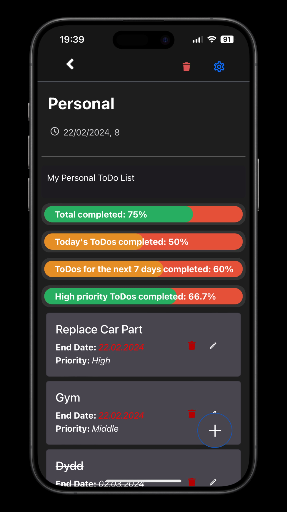
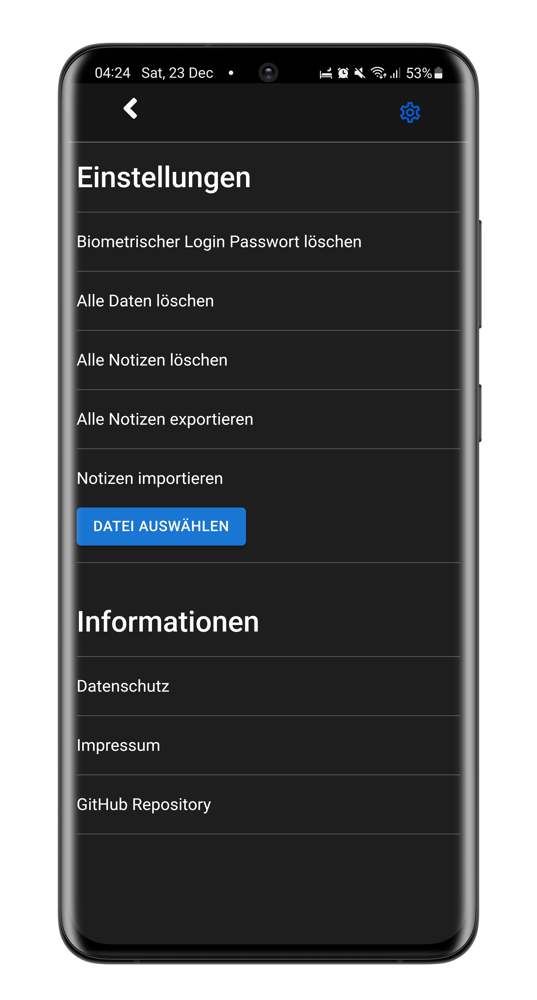
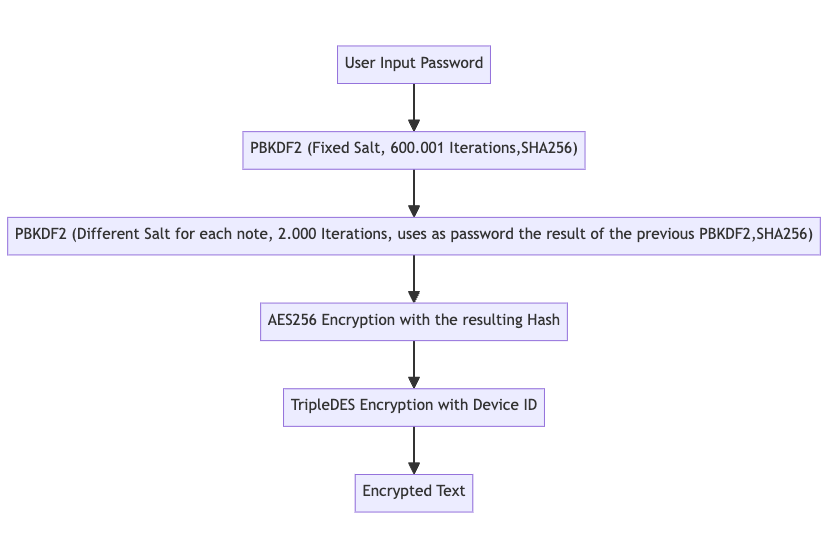
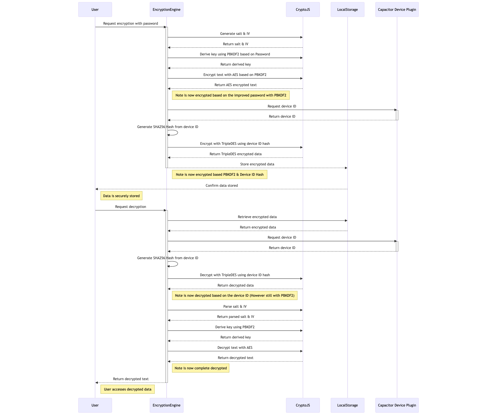

# Secure Planner

Last Edit: 03.2024 <br>
Language: Typescript React Capacitor<br>
[](https://sonarcloud.io/summary/new_code?id=ChristianScheub_Typescript_Capacitor_SecurePlanner)
[](https://sonarcloud.io/summary/new_code?id=ChristianScheub_Typescript_Capacitor_SecurePlanner) 
[](https://sonarcloud.io/summary/new_code?id=ChristianScheub_Typescript_Capacitor_SecurePlanner)
 [](https://sonarcloud.io/summary/new_code?id=ChristianScheub_Typescript_Capacitor_SecurePlanner)

[](https://sonarcloud.io/summary/new_code?id=ChristianScheub_Typescript_Capacitor_SecurePlanner)
[](https://sonarcloud.io/summary/new_code?id=ChristianScheub_Typescript_Capacitor_SecurePlanner)
[](https://sonarcloud.io/summary/new_code?id=ChristianScheub_Typescript_Capacitor_SecurePlanner) 
[](https://sonarcloud.io/summary/new_code?id=ChristianScheub_Typescript_Capacitor_SecurePlanner)
[](https://sonarcloud.io/dashboard?id=ChristianScheub_Typescript_Capacitor_SecurePlanner)


With this app, it is possible to securely store ToDo Lists locally with AES & Triple DES encryption, edit/delete them and search them.
It is also possible to decrypt the ToDo Lists using native biometrics (e.g. fingerprint sensor). (More on this under Security)
In addition to the security factor, the aim of this app is to enable the best possible organization of various ToDo elements. This is implemented through the mini dashboards in the overview etc., prioritization, categories and end dates for the individual ToDos.

Google Play Store: https://play.google.com/store/apps/details?id=de.scheub.securePlaner
<br />
Apple App Store: https://apps.apple.com/de/app/secureplanner/id6478185630
<br><br><br>

Deutsche Kurzbeschreibung:
Mit dieser App ist es möglich To DO Listen mit AES-Verschlüsselung & TripleDES sicher lokal zu speichern, sie zu bearbeiten/löschen und sie zu durchsuchen.
Zudem ist es möglich mithilfe der Native Biometric (z.B. Fingerabdruck Sensor) die Listen zu entschlüsseln. (Mehr dazu unter Security)
Neben dem Sicherheitsfaktor ist es das Ziel dieser App, die bestmögliche Organisation der verschiedenen ToDo-Elemente zu ermöglichen. Dies wird durch die Mini-Dashboards in der Übersicht etc., die Priorisierung und Deadlines für die einzelnen ToDos umgesetzt.

| App Store Screen 1                                                      | App Store Screen 2                                                      |
| ----------------------------------------------------------------------- | ----------------------------------------------------------------------- |
|  |  |

| Start Screen                                                            | ToDo List Overview                                                                         | ToDo List Edit                                                                     | Settings                                                          |
| ----------------------------------------------------------------------- | ------------------------------------------------------------------------------------------ | ---------------------------------------------------------------------------------- | ----------------------------------------------------------------- |
|  |  |  |  |

## Security

First of all: All To Do Lists are stored encrypted with AES256.

- The user's password is first hashed using PBKDF2 with 60,001 iterations and a fixed salt. (With medium security setting only 20,000 and if you select low none at all as there is no password)
- This hash is then passed through 2,000 iterations using PBKDF2 with a different salt for each ToDo list. (With medium security setting only 500 and if you select low none at all as there is no password)
- The resulting hash is then used for AES256 encryption.
- In addition, the data is encrypted with a SHA256 hash based on the device ID using TripleDES.
- No data is transferred to a cloud or similar.
- All data is processed and stored locally on the device.
  
  The security measures described below all refer to the high security setting, which is also the default setting.

### Justification

- Why is PBKDF2 performed twice?

  - So that it is possible to use a different salt for each ToDo list. This increases the protection against rainbow table attacks.
  - In addition, the recommended number of iterations for PBKDF2 can still be carried out without extremely poor performance. This increases protection against Brutal Force Attacks.
  - Such a high number of iterations in combination with different salts for each ToDo list has proven to be very slow and impractical on current devices (e.g. iPhone 14).
  - Furthermore, if a single ToDo list is decrypted, the others are not threatened.

- Why just use SHA256 for the PBKDF2?

  - Quick answer, simply because of the performance.
  - With a SHA512 hash for the login, a current Android flagship smartphone (from 2023) took an average of 50 seconds and a current iPhone around 15 seconds.
  - Since the performance with SHA256 is significantly better with Android around 10 seconds and iPhone 2-3 seconds, this was used.

- Why AES and TripleDES?
  - AES256 is currently the general recommendation. And since the goal was to use an additional encryption with a different password (here the deviceID), it was the right opportunity to use a different method.
  - So if AES256 or TripleDES have security problems, this can work as a further protection measure.
  - It also increases the effort for attackers as they have to decrypt two different methods.
  - Since it also offers no disadvantages (except performance), e.g. a hack of the TripleDES encryption still leads to the AES encryption having to be decrypted, the advantages were seen to outweigh the disadvantages.

<br />

### Encryption Engine Flow

The encryption and decryption process is also shown here.
The password is already understood to be the PBKDF2 processed hash with 60,001 iterations, as only this is used within the application as soon as it has been generated after opening the app.

Anyone interested is free to take a closer look at this and make suggestions for improvement. The entire encryption/decryption logic takes place in the EncryptionEngine. (Except the logic of the biometric login)

<br /><br /><br />

### Security Fingerprint Login

- The password is stored in the KeyStore on Android and in the keychain on iOS if biometric authentication is enabled. These stores are secure according to the OS publisher.
  If this is not used, the password is not saved either.
- Only the first PBKDF2 hash from the first derivation is used. No password in plain text or similar. This is also the reason for the significantly faster login with a biometric login.
- The password hash is encrypted with TripleDES as it does not usually need to be decrypted frequently.
- The password hash is encrypted with a SHA256 hash from the deviceID/identifier of the device provided by Capacitor before it is stored. (Just to be safe and independent of OS security.)

  <i>On iOS, the identifier is a UUID that uniquely identifies a device to the app’s vendor ([read more](https://developer.apple.com/documentation/uikit/uidevice/1620059-identifierforvendor)).

  On Android 8+, **the identifier is a 64-bit number (expressed as a hexadecimal string)**, unique to each combination of app-signing key, user, and device ([read more](https://developer.android.com/reference/android/provider/Settings.Secure#ANDROID_ID)).</i>

### Security Export/Import

- When the ToDo lists are exported, they are no longer encrypted with the SHA256 hash of the DeviceID. However, they are encrypted using AES with a specific word which is hard-coded here.

- As before, the ToDo lists are also encrypted with PBKDF2 and should only be decryptable with the user's password.

- When importing the data, the data must be decrypted with the user's password, otherwise it should not be visible.

### Note on the security measures

- The secure encryption of data/ToDo lists cannot be guaranteed.
- The application has been developed to be as secure as possible from the developer's point of view.
- It is open to anyone to review the security measures here and report any security vulnerabilities identified here. (This is why the application is open source)
- The Crypto-JS node package is used for encryption. If this has security gaps or similar, the data here is insecure!

## Distribution

- Android/iOS: The app is distributed in the Google Play Store and Apple App Store with the help of Capacitor.
- Windows: With the help of Electron, it is distributed in the Microsoft App Store as MSI. Installation. (Without support for Windows Hello/fingerprint scanner)
- Mac: It is possible to use the Electron app from the repo. However, it is recommended to simply download the iOS app from the Apple App Store for M1 MacBooks. This app also supports Touch ID etc. directly.

## Testing

The Jest testing framework is used for testing.
The tests here are always written in Typescript.

The goal is actually to have about 80% test coverage of the lines. This number appears to be enough as this is a freetime project. 
This seems to be sufficient, as there are already 197 tests...

File                                                                               | % Stmts | % Branch | % Funcs | % Lines | Uncovered Line #s                      
-----------------------------------------------------------------------------------|---------|----------|---------|---------|----------------------------------------
All files                                                                          |   85.98 |    73.83 |   81.32 |    86.4 |                                        
 src                                                                               |      95 |     62.5 |      80 |     100 |                                        
  App.tsx                                                                          |     100 |      100 |     100 |     100 |                                        
  darkModeDetector.ts                                                              |      90 |       25 |      75 |     100 | 8-12                                   
  i18n.ts                                                                          |     100 |      100 |     100 |     100 |                                        
  index.tsx                                                                        |     100 |      100 |     100 |     100 |                                        
 src/custom_components/config                                                      |     100 |      100 |     100 |     100 |                                        
  featureFlags.ts                                                                  |     100 |      100 |     100 |     100 |                                        
  notAllowedStrings.ts                                                             |     100 |      100 |     100 |     100 |                                        
  toIgnoreKeys.ts                                                                  |     100 |      100 |     100 |     100 |                                        
 src/custom_components/enums                                                       |       0 |        0 |       0 |       0 |                                        
  SecurityLevel.enum.ts                                                            |       0 |        0 |       0 |       0 |                                        
  priority.enum.ts                                                                 |       0 |        0 |       0 |       0 |                                        
 src/custom_components/handleNotes/editNote/container                              |   60.43 |    43.33 |      40 |   60.43 |                                        
  container-editNote.tsx                                                           |   60.43 |    43.33 |      40 |   60.43 | ...183-185,189-195,203-212,219-230,262 
 src/custom_components/handleNotes/editNote/screen                                 |   55.55 |    64.28 |   42.85 |   55.55 |                                        
  screen-editNote.tsx                                                              |   55.55 |    64.28 |   42.85 |   55.55 | 127-194                                
 src/custom_components/handleNotes/editNote/screen/ui/dateWithClock                |     100 |      100 |     100 |     100 |                                        
  dateWithClock.tsx                                                                |     100 |      100 |     100 |     100 |                                        
 src/custom_components/handleNotes/editNote/screen/ui/progressBar                  |     100 |      100 |     100 |     100 |                                        
  progressBar.tsx                                                                  |     100 |      100 |     100 |     100 |                                        
 src/custom_components/handleNotes/editNote/screen/ui/progressBarMenu              |      80 |    83.33 |      60 |      80 |                                        
  progressBarMenu.tsx                                                              |     100 |      100 |     100 |     100 |                                        
  progressBarScreen.tsx                                                            |   69.23 |       50 |   33.33 |   69.23 | 45-75                                  
 src/custom_components/handleNotes/editToDoElement/container                       |      80 |    58.53 |     100 |      80 |                                        
  container-editToDo.tsx                                                           |      80 |    58.53 |     100 |      80 | 61-74,89,127,139,177-181,189-196,231   
 src/custom_components/handleNotes/editToDoElement/screens                         |      80 |      100 |   66.66 |      80 |                                        
  screen-editToDo-TooMuch.tsx                                                      |     100 |      100 |     100 |     100 |                                        
  screen-editToDo.tsx                                                              |   71.42 |      100 |      60 |   71.42 | 79-84                                  
 src/custom_components/handleNotes/editToDoElement/screens/ui/dataPicker           |      80 |       50 |   66.66 |      80 |                                        
  dataPicker.tsx                                                                   |      80 |       50 |   66.66 |      80 | 41                                     
 src/custom_components/handleNotes/editToDoElement/screens/ui/priorityIndicator    |     100 |      100 |     100 |     100 |                                        
  priorityIndicator.tsx                                                            |     100 |      100 |     100 |     100 |                                        
 src/custom_components/handleNotes/viewNote/container                              |      95 |       84 |   94.11 |   94.73 |                                        
  container-viewNote.tsx                                                           |   91.17 |    78.57 |    87.5 |    90.9 | 28,38,68                               
  getNotes.ts                                                                      |     100 |     90.9 |     100 |     100 | 19                                     
 src/custom_components/handleNotes/viewNote/screen                                 |     100 |      100 |     100 |     100 |                                        
  screen-viewNote.tsx                                                              |     100 |      100 |     100 |     100 |                                        
 src/custom_components/notNotesRelated/encryption_modal/container                  |      75 |       50 |   86.66 |      75 |                                        
  container-encryption-modal.tsx                                                   |      75 |       50 |   86.66 |      75 | 47-49,65-71,115-133                    
 src/custom_components/notNotesRelated/encryption_modal/screen                     |     100 |      100 |     100 |     100 |                                        
  screen-encryption-modal.tsx                                                      |     100 |      100 |     100 |     100 |                                        
 src/custom_components/notNotesRelated/navBar/container                            |      84 |    56.25 |   71.42 |      84 |                                        
  container-navBar.tsx                                                             |      84 |    56.25 |   71.42 |      84 | 27,46-48                               
 src/custom_components/notNotesRelated/navBar/screen                               |     100 |    83.33 |     100 |     100 |                                        
  screen-navBar.tsx                                                                |     100 |    83.33 |     100 |     100 | 48                                     
 src/custom_components/notNotesRelated/settings/container                          |   52.17 |    21.42 |   41.66 |   52.17 |                                        
  container_settings.tsx                                                           |   52.17 |    21.42 |   41.66 |   52.17 | 14-17,21-24,45-58,77-87,91,104         
 src/custom_components/notNotesRelated/settings/screen                             |     100 |    63.63 |     100 |     100 |                                        
  screen_settings.tsx                                                              |     100 |    63.63 |     100 |     100 | 44-65,81                               
 src/custom_components/notNotesRelated/welcomeScreen/container                     |   94.73 |    83.33 |     100 |     100 |                                        
  container-welcomeScreen.tsx                                                      |   94.73 |    83.33 |     100 |     100 | 22                                     
 src/custom_components/notNotesRelated/welcomeScreen/container/SubContainer        |   93.33 |    66.66 |   92.85 |   94.73 |                                        
  container-welcome1.tsx                                                           |     100 |      100 |     100 |     100 |                                        
  container-welcome2.tsx                                                           |     100 |      100 |     100 |     100 |                                        
  container-welcome3.tsx                                                           |     100 |       75 |     100 |     100 | 24                                     
  container-welcome4.tsx                                                           |     100 |      100 |     100 |     100 |                                        
  container-welcome5.tsx                                                           |   71.42 |       25 |   66.66 |   76.92 | 21-26                                  
 src/custom_components/notNotesRelated/welcomeScreen/screens                       |    90.9 |      100 |   83.33 |    90.9 |                                        
  screen-welcome1.tsx                                                              |     100 |      100 |     100 |     100 |                                        
  screen-welcome2.tsx                                                              |     100 |      100 |     100 |     100 |                                        
  screen-welcome3.tsx                                                              |     100 |      100 |     100 |     100 |                                        
  screen-welcome4.tsx                                                              |     100 |      100 |     100 |     100 |                                        
  screen-welcome5.tsx                                                              |   66.66 |      100 |      50 |   66.66 | 56                                     
 src/custom_components/notNotesRelated/welcomeScreen/screens/ui/continueBtn        |     100 |      100 |     100 |     100 |                                        
  continue-button.tsx                                                              |     100 |      100 |     100 |     100 |                                        
 src/custom_components/notNotesRelated/welcomeScreen/screens/ui/passwordInputField |     100 |      100 |     100 |     100 |                                        
  passwordInputField.tsx                                                           |     100 |      100 |     100 |     100 |                                        
 src/custom_components/notNotesRelated/welcomeScreen/screens/ui/progressDots       |     100 |      100 |     100 |     100 |                                        
  progressDots.tsx                                                                 |     100 |      100 |     100 |     100 |                                        
 src/custom_components/notNotesRelated/welcomeScreen/screens/ui/radioBtns          |     100 |      100 |     100 |     100 |                                        
  generic-radioBtn.tsx                                                             |     100 |      100 |     100 |     100 |                                        
 src/custom_components/services/encryptionEngine                                   |   92.59 |    84.84 |     100 |   92.59 |                                        
  encryptionEngine.ts                                                              |   92.59 |    84.84 |     100 |   92.59 | 162,177-178,200,204-205                
 src/custom_components/services/equals                                             |     100 |      100 |     100 |     100 |                                        
  equals.ts                                                                        |     100 |      100 |     100 |     100 |                                        
 src/custom_components/services/fileHandler                                        |   94.87 |    67.64 |     100 |   95.94 |                                        
  fileHandler.ts                                                                   |   89.47 |    64.28 |     100 |   91.42 | 49,70-71                               
  fileHandlerHelper.ts                                                             |     100 |    83.33 |     100 |     100 | 53                                     
 src/custom_components/services/fingerprintLogic                                   |   97.87 |    92.85 |     100 |   97.87 |                                        
  fingerprintLogic.ts                                                              |   97.87 |    92.85 |     100 |   97.87 | 61                                     
 src/custom_components/services/formatDate                                         |     100 |      100 |     100 |     100 |                                        
  formatDate.ts                                                                    |     100 |      100 |     100 |     100 |                                        
 src/custom_components/services/logger                                             |     100 |      100 |     100 |     100 |                                        
  loggerFeatureFlags.ts                                                            |     100 |      100 |     100 |     100 |                                        
 src/custom_components/services/progressToDoListService                            |   73.33 |    83.33 |   55.55 |   81.48 |                                        
  progressToDoListService.ts                                                       |   73.33 |    83.33 |   55.55 |   81.48 | 79-88                                  
 src/custom_components/services/textValidation                                     |     100 |      100 |     100 |     100 |                                        
  containsNotAllowedCharacters.ts                                                  |     100 |      100 |     100 |     100 |                                        
 src/custom_components/services/toDoListHandler                                    |     100 |      100 |     100 |     100 |                                        
  IToDoListService.ts                                                              |       0 |        0 |       0 |       0 |                                        
  toDoListHandler.ts                                                               |     100 |      100 |     100 |     100 |                                        
 src/custom_components/services/toDoListHandler/Categories                         |     100 |      100 |     100 |     100 |                                        
  categories.ts                                                                    |     100 |      100 |     100 |     100 |                                        
 src/custom_components/services/toDoListHandler/Filter                             |     100 |      100 |     100 |     100 |                                        
  toDoListFilter.ts                                                                |     100 |      100 |     100 |     100 |                                        
 src/custom_components/services/toDoListHandler/Persistence                        |   76.47 |    81.25 |   57.14 |   77.08 |                                        
  toDoListPersistence.ts                                                           |   76.47 |    81.25 |   57.14 |   77.08 | 14-15,43-44,58-59,73-79                
 src/custom_components/services/toDoListHandler/Sorter                             |    92.3 |    91.66 |     100 |    92.3 |                                        
  toDoListSort.ts                                                                  |    92.3 |    91.66 |     100 |    92.3 | 26                                     
 src/custom_components/types                                                       |       0 |        0 |       0 |       0 |                                        
  ToDoItem.types.ts                                                                |       0 |        0 |       0 |       0 |                                        
  ToDoList.types.ts                                                                |       0 |        0 |       0 |       0 |                                        
  ToDoListKey.types.ts                                                             |       0 |        0 |       0 |       0 |                                        
 src/modules/app_configuration                                                     |     100 |      100 |     100 |     100 |                                        
  app_texts.ts                                                                     |     100 |      100 |     100 |     100 |                                        
 src/modules/legal                                                                 |     100 |    71.42 |     100 |     100 |                                        
  codeToTextParser.tsx                                                             |     100 |      100 |     100 |     100 |                                        
  datenschutz.tsx                                                                  |     100 |       50 |     100 |     100 | 14-30                                  
  impressum.tsx                                                                    |     100 |       50 |     100 |     100 | 14-30                                  
 src/modules/legal/usedLibs                                                        |     100 |      100 |     100 |     100 |                                        
  container_usedLibList.tsx                                                        |     100 |      100 |     100 |     100 |                                        
  screen_usedLibList.tsx                                                           |     100 |      100 |     100 |     100 |                                        
 src/modules/ui/floatingBtn                                                        |     100 |      100 |     100 |     100 |                                        
  floatingBtn.tsx                                                                  |     100 |      100 |     100 |     100 |                                        
 src/modules/ui/progress/progressCircle                                            |     100 |      100 |     100 |     100 |                                        
  progressCircle.tsx                                                               |     100 |      100 |     100 |     100 |        

## Architecture

The components used are divided into four categories:

- `UI-Elements`
- `View-Componets`
- `Container-Componets`
- `ServiceLayer`

Note: Some of the modules are used from other Web Apps like the Encryption Engine or the Impressum/Imprint Modules.
As a result of the use from the modules, some files have an the name "note" instead of "todoList" inside and there is also one configuration file:

- `app_texts`: Contains texts such as the description, imprint text, data protection text etc.

In addition, the separation is not 100% sharp, partly because of these modules, but also because the final architecture only turned out that way during development.

`UI-Elements`
At the topmost level, UI-Elements are the fundamental building blocks of our interface. These are the atomic components that include buttons, input fields, and other basic interactive elements. They are styled and abstracted to be reusable across the application.

`View-Components`
View-Components are composed of UI-Elements and form parts of the application's screens. They are responsible for presenting data and handling user interactions. These components are often reusable within different parts of the application and can communicate with Container-Components for dynamic data fetching.

`Container-Components`
Container-Components serve as the data-fetching and state management layer in our architecture. They connect View-Components to the Service Layer, managing the application state and providing data to the components as necessary. They may also handle complex user interactions, form submissions, and communicate with services to send or receive data.

`Service Layer`
The Service Layer is the foundation of our application's client-side architecture. It abstracts all the handling wth the ToDo Lists (LocalStorage handling included), the fingerprint logic (e.g. password storage in secure storage), helpful functions (e.g. formatDate,equals) and the encryption engine logic.

There is a large ToDo List service which is also subdivided into smaller services. This design was considered practicable here to make this very large service easy to maintain in the future. This was not necessary for the others and they are simple export functions.


Note: The App.tsx, the interfaces and props are hidden here to make it easy to keep an overview.
(The architecture image is not completely up-to-date and therefore does not yet include the logger service, for example. However, it still gives a good overview and includes almost everything)

## Troubleshooting

### While generate Electron App for Windows/Mac/LNX

```
node_modules/builder-util-runtime/out/httpExecutor.d.ts:9:5 - error TS2411: Property '"accept-charset"' of type 'string | string[]' is not assignable to 'string' index type 'string'.

9     [key: string]: string;
      ~~~~~~~~~~~~~~~~~~~~~~
```

For whatever reason, this NPM module is not 100% compatible. The easy fix is to simply change the location in the error so that the file type matches.
Just adjust the module inside the Electron folder under node_modules by adjust the line:

```
export interface RequestHeaders extends OutgoingHttpHeaders {
    [key: string]: string | string[]|number | undefined;
}
```

is adapted to this:
export interface RequestHeaders extends OutgoingHttpHeaders {
[key: string]: string | string[];
}

## Available Scripts

In the project directory, you can run:

### `npm start`

Runs the app in the development mode.\
Open [http://localhost:3000](http://localhost:3000) to view it in the browser.

The page will reload if you make edits.\
You will also see any lint errors in the console.

### `npm test`

Launches the test runner in the interactive watch mode.\
See the section about [running tests](https://facebook.github.io/create-react-app/docs/running-tests) for more information.

### `npm test -- --coverage --watchAll`

Returns the complete test coverage rate in the form of a table for all files.

### `npm run build`

Builds the app for production to the `build` folder.\
It correctly bundles React in production mode and optimizes the build for the best performance.

The build is minified and the filenames include the hashes.\
Your app is ready to be deployed!

See the section about [deployment](https://facebook.github.io/create-react-app/docs/deployment) for more information.

### `npx cap sync`

This command will synchronize the iOS and Android project and bring it up to the current status of the web app.

### `npx cap open ios`

This command will open XCode with the current Capacitor project so that you can build the app directly.

### `npx cap open android`

This command will open Android Studio with the current Capacitor project so that you can build the app directly.

### `./node_modules/.bin/license-checker --json --production --out licenses.json`

Generate the JSON with the licenses of the NPM packages used.
This can then replace the existing license json under modules/legal/usedLibs.

### `npm run eject`

**Note: this is a one-way operation. Once you `eject`, you can’t go back!**

If you aren’t satisfied with the build tool and configuration choices, you can `eject` at any time. This command will remove the single build dependency from your project.

Instead, it will copy all the configuration files and the transitive dependencies (webpack, Babel, ESLint, etc) right into your project so you have full control over them. All of the commands except `eject` will still work, but they will point to the copied scripts so you can tweak them. At this point you’re on your own.

You don’t have to ever use `eject`. The curated feature set is suitable for small and middle deployments, and you shouldn’t feel obligated to use this feature. However we understand that this tool wouldn’t be useful if you couldn’t customize it when you are ready for it.

## Used NPM Modules

According to the command npm list
You can see the deeper NPM modules used and which of these are used in the licenses.json.

├── @babel/core@7.24.7

├── @babel/plugin-proposal-private-property-in-object@7.21.11

├── @babel/preset-env@7.24.7

├── @capacitor-community/electron@5.0.1

├── @capacitor/android@5.7.6

├── @capacitor/app@5.0.8

├── @capacitor/cli@5.7.6

├── @capacitor/core@5.7.6

├── @capacitor/device@5.0.8

├── @capacitor/filesystem@5.2.2

├── @capacitor/ios@5.7.6

├── @capacitor/share@5.0.8

├── @emotion/react@11.11.4

├── @emotion/styled@11.11.5

├── @mui/material@5.16.0

├── @testing-library/jest-dom@5.17.0

├── @testing-library/react@13.4.0

├── @testing-library/user-event@13.5.0

├── @types/crypto-js@4.2.2

├── @types/jest@27.5.2

├── @types/node@16.18.101

├── @types/react-datepicker@6.2.0

├── @types/react-dom@18.3.0

├── @types/react@18.3.3

├── babel-jest@29.7.0

├── bootstrap-icons@1.11.3

├── bootstrap@5.3.3

├── capacitor-native-biometric@4.2.2

├── crypto-js@4.2.0

├── electron-builder@24.13.3

├── i18next-browser-languagedetector@7.2.1

├── i18next@23.11.5

├── license-checker@25.0.1

├── react-bootstrap@2.10.4

├── react-datepicker@6.9.0

├── react-dom@18.3.1

├── react-i18next@14.1.2

├── react-icons@4.12.0

├── react-router-dom@6.24.1

├── react-scripts@5.0.1

├── react-swipeable@7.0.1

├── react@18.3.1

└── typescript@4.9.5